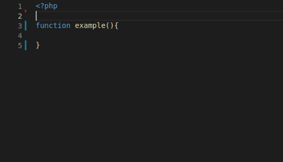

# insider-framework-vscode-snippets README

This is an extension that contains a bunch of snippets for use with Insider Framework in Visual Studio Code.

## Features

There are snippets for all kind of uses in the application. All you need to do it's install and enable the extension and use it. This is an example:

## Release Notes

### 1.0.0

Initial release of insider-framework-vscode-snippets extension